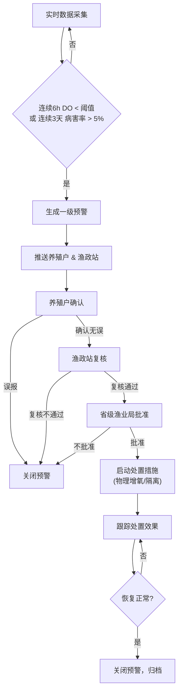
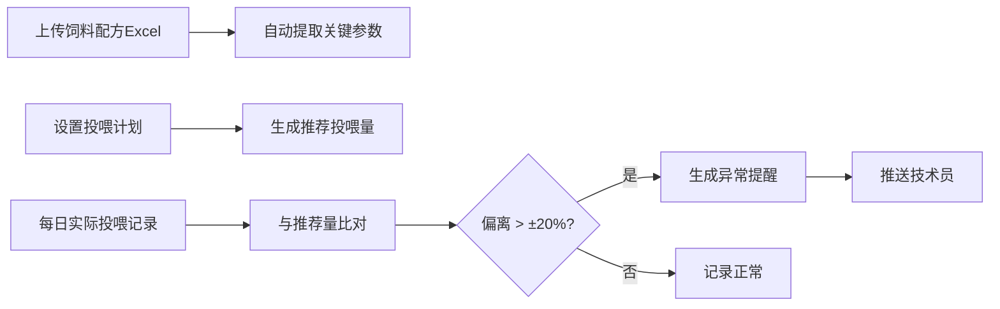

## 1. 产品概述

全国性水产养殖环境与病害监测预警智能分析平台，面向国家、省、市三级渔业管理部门及广大养殖户，提供实时水质监测、病害预警、产量预测、饲料管理及健康诊断等全链条智能化服务。通过物联网数据实时采集、AI分析与多级审批联动，实现水产养殖精细化管理与风险防控。

## 2. 核心功能

### 2.1 用户角色

| 角色 | 注册方式 | 核心权限 |
|------|----------|----------|
| 国家级管理员 | 系统分配 | 查看全国数据、全国统计报表、系统管理 |
| 省级管理员 | 系统分配 | 查看本省数据、审批预警处置、省级统计报表 |
| 市级/渔政站管理员 | 系统分配 | 查看本市数据、复核预警处置、市级统计报表 |
| 养殖户 | 自主注册/审核通过 | 查看本场数据、确认预警、上传投喂记录、管理饲料配方 |
| 技术员 | 养殖户邀请 | 查看投喂异常提醒、技术指导 |

### 2.2 功能模块

1. **登录页**: 角色选择登录、权限校验
2. **核心看板**: 全国水质热力图、产量排名、关键指标概览、省份/品种切换
3. **养殖区详情**: 近7天水质趋势曲线、病害类型分布、养殖池明细
4. **预警中心**: 预警列表、预警详情、三级审批流程、处置措施管理
5. **饲料管理**: 饲料配方Excel上传、投喂计划管理、投喂偏离异常提醒
6. **健康诊断报告**: 周报自动生成、成活率同比环比、水质达标率变化、优化建议
7. **系统管理**: 用户管理、权限配置、阈值设置、品种管理

### 2.3 页面详情

| 页面名称 | 模块名称 | 功能描述 |
|----------|----------|----------|
| 登录页 | 登录表单 | 账号密码登录、角色选择、验证码、忘记密码 |
| 核心看板 | 指标概览卡片 | 全国养殖场数、水质达标率、病害发生率、预计总产量、平均成活率 |
| 核心看板 | 省份/品种筛选 | 下拉筛选省份、养殖品种，联动所有图表 |
| 核心看板 | 水质达标热力图 | 中国地图按省份着色展示水质达标率，hover显示详情，点击下钻 |
| 核心看板 | 产量排名TOP10 | 条形图展示省份产量排名，支持切换品种 |
| 核心看板 | 实时预警列表 | 展示最新预警信息，点击跳转预警详情 |
| 养殖区详情 | 水质趋势曲线 | 近7天溶解氧、pH、氨氮、水温多指标折线图 |
| 养殖区详情 | 病害分布饼图 | 各类病害占比统计 |
| 养殖区详情 | 养殖池列表 | 各养殖池实时数据、状态标识 |
| 预警中心 | 预警列表 | 按状态筛选(待确认/待复核/待批准/处理中/已关闭)、级别筛选 |
| 预警中心 | 预警详情 | 触发原因、历史数据、影响范围、审批流程时间线 |
| 预警中心 | 三级审批 | 养殖户确认→渔政站复核→省级渔业局批准，每级可填写意见 |
| 预警中心 | 处置措施 | 物理增氧启动、隔离措施、记录处置过程 |
| 饲料管理 | 配方上传 | Excel模板下载、拖拽上传、自动解析关键参数 |
| 饲料管理 | 投喂计划 | 按养殖池设置投喂量、投喂频次 |
| 饲料管理 | 异常提醒 | 实际投喂偏离推荐量±20%时生成提醒，推送技术员 |
| 健康诊断 | 周报列表 | 按周查看历史报告，支持导出PDF |
| 健康诊断 | 报告详情 | 成活率同比环比、水质达标率变化趋势、病害分布、优化投喂/换水方案 |
| 系统管理 | 用户管理 | 新增/编辑用户、分配角色与管辖区域 |
| 系统管理 | 阈值配置 | 溶解氧阈值、病害率阈值、投喂偏离阈值配置 |

## 3. 核心流程

### 3.1 预警触发与处置流程

实时水质与病害数据持续采集，系统自动检测异常：当某养殖区连续6小时溶解氧低于阈值或连续3天病害率超过5%时，自动触发一级预警。预警推送至养殖户和属地渔政站，启动三级审批流程：养殖户首先确认预警情况，渔政站现场复核后提交省级渔业局批准，批准通过后方可启动物理增氧或隔离措施。每一级审批均需填写处理意见，全流程留痕可追溯。

### 3.2 投喂异常检测流程

养殖户上传饲料配方与投喂计划，系统自动提取蛋白含量、投喂量、投喂频次等关键参数。每日实际投喂数据上传后，系统自动与推荐量比对，当偏离度超过±20%时生成异常提醒，推送至关联技术员进行干预指导。

## 4. 用户界面设计

### 4.1 设计风格

- **主色调**: 深海蓝 `#0A4D68`，体现水产业海洋特征与专业感
- **辅助色**: 青碧色 `#088395`、水绿色 `#05BFDB`、警示橙 `#FF6B35`、危险红 `#E63946`
- **中性色**: 墨色 `#1A1A2E`、深灰 `#2D2E3A`、浅灰 `#F0F4F8`
- **按钮风格**: 圆角4px，扁平化设计，hover时轻微上浮阴影
- **字体**: 标题使用"Noto Serif SC"体现稳重专业，正文使用"Noto Sans SC"保障可读性
- **布局风格**: 顶部导航 + 左侧菜单的经典仪表盘布局，卡片式内容区，大量留白
- **图标风格**: Lucide线性图标，配合水波纹、鱼等水产主题装饰元素

### 4.2 页面设计概览

| 页面名称 | 模块名称 | UI元素 |
|----------|----------|--------|
| 登录页 | 登录区域 | 左侧品牌插画(水波纹+鱼群动画)、右侧简洁表单、蓝色渐变背景 |
| 核心看板 | 指标卡片 | 大数字展示、迷你趋势图、渐变背景、hover放大效果 |
| 核心看板 | 热力图 | 深蓝色调中国地图、渐变色填充省份、hover浮层展示详情 |
| 核心看板 | 排名列表 | 金/银/铜奖牌标识、条形进度条、名次徽章 |
| 养殖区详情 | 趋势曲线 | 多色折线、数据点标记、区域渐变填充、时间轴缩放 |
| 预警中心 | 审批时间线 | 垂直时间轴、审批节点状态颜色区分、头像+意见展示 |
| 饲料管理 | 上传区域 | 虚线框拖拽区、Excel图标、上传进度条、解析结果预览 |
| 健康诊断 | 报告详情 | 多卡片布局、同比环比箭头标识、方案建议卡片 |

### 4.3 响应式

采用桌面优先设计，适配1440px及以上主流分辨率。关键数据看板在平板端(≥768px)保持双列布局，手机端单列堆叠。热力图与图表组件自适应容器宽度，导航菜单在小屏幕转为抽屉式侧边栏。

### 4.4 视觉动效

- 页面加载：指标卡片数字滚动动画、图表渐入绘制
- Hover交互：卡片轻微上浮+阴影加深、按钮背景色渐变过渡
- 数据更新：实时数据点闪烁提示、预警通知滑入动画
- 审批流程：节点完成时对勾动画、进度条平滑过渡
