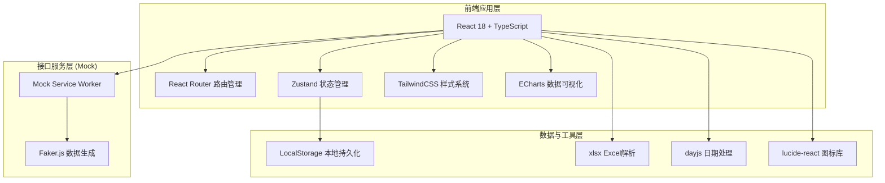
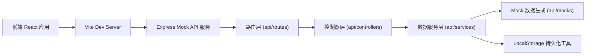
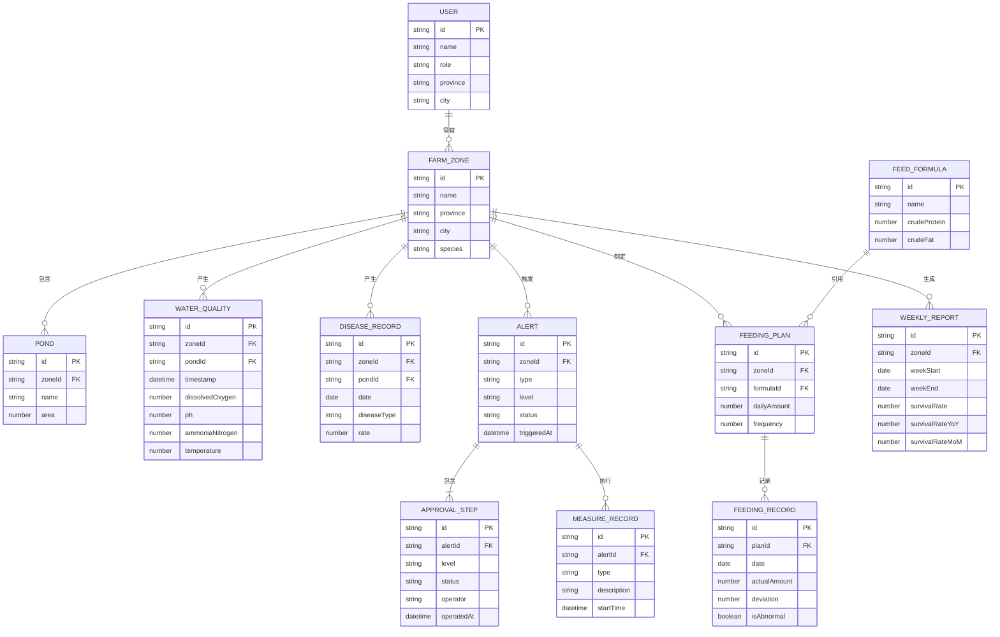

## 1. 架构设计



## 2. 技术描述

- **前端**: React@18 + TypeScript@5 + Vite@5
- **初始化工具**: vite-init (react-express-ts 模板)
- **后端**: Express@4 (提供Mock API服务)
- **数据库**: 无后端数据库，使用 Mock Service Worker + LocalStorage 进行数据持久化模拟
- **UI框架**: TailwindCSS@3
- **状态管理**: Zustand@4
- **路由**: React Router DOM@6
- **图表库**: ECharts@5 (含中国地图GeoJSON)
- **工具库**: lucide-react (图标)、dayjs (日期)、xlsx (Excel解析)、clsx (类名合并)

## 3. 路由定义

| 路由 | 页面 | 权限角色 | 说明 |
|------|------|----------|------|
| /login | 登录页 | 公开 | 角色选择登录入口 |
| /dashboard | 核心看板 | 全部登录用户 | 水质热力图、产量排名、指标概览 |
| /zone/:id | 养殖区详情 | 全部登录用户 | 水质趋势、病害分布、养殖池明细 |
| /alerts | 预警中心 | 全部登录用户 | 预警列表、审批流程、处置管理 |
| /alerts/:id | 预警详情 | 全部登录用户 | 预警详情、三级审批操作 |
| /feed | 饲料管理 | 养殖户、技术员 | 配方上传、投喂计划、异常提醒 |
| /reports | 健康诊断报告 | 全部登录用户 | 周报列表、报告详情 |
| /system/users | 用户管理 | 国家级、省级 | 账号与权限管理 |
| /system/settings | 系统设置 | 国家级管理员 | 阈值配置、品种管理 |

## 4. API 定义 (Mock)

### 4.1 TypeScript 类型定义

```typescript
// 角色类型
type UserRole = 'national' | 'provincial' | 'municipal' | 'farmer' | 'technician';

interface User {
  id: string;
  name: string;
  role: UserRole;
  province?: string;
  city?: string;
  avatar?: string;
  permissions: string[];
}

// 养殖场/养殖区
interface FarmZone {
  id: string;
  name: string;
  province: string;
  city: string;
  species: string[];
  totalArea: number;
  pondCount: number;
}

// 实时水质数据
interface WaterQuality {
  id: string;
  zoneId: string;
  pondId?: string;
  timestamp: string;
  dissolvedOxygen: number;  // 溶解氧 mg/L
  ph: number;               // pH值
  ammoniaNitrogen: number;  // 氨氮 mg/L
  temperature: number;      // 水温 ℃
}

// 水质指标阈值
interface ThresholdConfig {
  dissolvedOxygenMin: number;    // 溶解氧下限
  phMin: number;
  phMax: number;
  ammoniaNitrogenMax: number;
  temperatureMin: number;
  temperatureMax: number;
  diseaseRateMax: number;        // 病害率阈值 %
  feedDeviationMax: number;      // 投喂偏离阈值 %
}

// 病害记录
interface DiseaseRecord {
  id: string;
  zoneId: string;
  pondId?: string;
  date: string;
  diseaseType: string;
  affectedCount: number;
  totalCount: number;
  rate: number;
}

// 预警
type AlertLevel = 'primary' | 'secondary' | 'tertiary';
type AlertStatus = 'pending_confirm' | 'pending_review' | 'pending_approve' | 'processing' | 'closed' | 'false_alarm';
type AlertType = 'dissolved_oxygen' | 'disease';

interface Alert {
  id: string;
  zoneId: string;
  zoneName: string;
  level: AlertLevel;
  type: AlertType;
  status: AlertStatus;
  triggerReason: string;
  triggeredAt: string;
  affectedPonds: string[];
  approvalFlow: ApprovalStep[];
  measures?: MeasureRecord[];
}

interface ApprovalStep {
  id: string;
  level: 'farmer' | 'fishery_station' | 'provincial_bureau';
  status: 'pending' | 'approved' | 'rejected';
  operator: string;
  operatorRole: string;
  opinion?: string;
  operatedAt?: string;
}

interface MeasureRecord {
  id: string;
  type: 'aeration' | 'isolation' | 'water_change' | 'medication';
  description: string;
  operator: string;
  startTime: string;
  endTime?: string;
}

// 饲料配方
interface FeedFormula {
  id: string;
  name: string;
  uploadedBy: string;
  uploadedAt: string;
  crudeProtein: number;      // 粗蛋白 %
  crudeFat: number;          // 粗脂肪 %
  crudeFiber: number;        // 粗纤维 %
  ash: number;               // 灰分 %
  moisture: number;          // 水分 %
  suitableSpecies: string[];
}

// 投喂计划
interface FeedingPlan {
  id: string;
  zoneId: string;
  pondId: string;
  formulaId: string;
  dailyAmount: number;       // kg
  frequency: number;         // 次/天
  startTime: string;
  endTime?: string;
}

// 投喂记录
interface FeedingRecord {
  id: string;
  planId: string;
  date: string;
  actualAmount: number;
  deviation: number;         // 偏离度 %
  isAbnormal: boolean;
}

// 周报
interface WeeklyReport {
  id: string;
  zoneId: string;
  weekStart: string;
  weekEnd: string;
  survivalRate: number;
  survivalRateYoY: number;   // 同比
  survivalRateMoM: number;   // 环比
  waterQualityPassRate: number;
  waterQualityPassRateChange: number;
  diseaseDistribution: { type: string; count: number; rate: number }[];
  feedingOptimization: string;
  waterChangeRecommendation: string;
  generatedAt: string;
}

// 省份统计
interface ProvinceStats {
  province: string;
  farmCount: number;
  waterQualityPassRate: number;
  diseaseRate: number;
  estimatedYield: number;    // 吨
  avgSurvivalRate: number;
}
```

### 4.2 API 接口列表

| 方法 | 路径 | 说明 |
|------|------|------|
| POST | /api/auth/login | 用户登录 |
| GET | /api/auth/me | 获取当前用户信息 |
| GET | /api/stats/overview | 获取概览指标 |
| GET | /api/stats/provinces | 获取各省统计数据(热力图) |
| GET | /api/stats/yield-ranking | 获取产量排名 |
| GET | /api/zones | 获取养殖区列表 |
| GET | /api/zones/:id | 获取养殖区详情 |
| GET | /api/zones/:id/water-quality | 获取近7天水质数据 |
| GET | /api/zones/:id/diseases | 获取病害分布 |
| GET | /api/zones/:id/ponds | 获取养殖池列表 |
| GET | /api/alerts | 获取预警列表 |
| GET | /api/alerts/:id | 获取预警详情 |
| POST | /api/alerts/:id/confirm | 养殖户确认预警 |
| POST | /api/alerts/:id/review | 渔政站复核 |
| POST | /api/alerts/:id/approve | 省级批准 |
| POST | /api/alerts/:id/measures | 启动处置措施 |
| GET | /api/feed/formulas | 获取饲料配方列表 |
| POST | /api/feed/formulas/upload | 上传并解析Excel配方 |
| GET | /api/feed/plans | 获取投喂计划 |
| POST | /api/feed/plans | 创建投喂计划 |
| GET | /api/feed/records | 获取投喂记录与异常 |
| GET | /api/reports | 获取周报列表 |
| GET | /api/reports/:id | 获取周报详情 |
| GET | /api/system/users | 获取用户列表 |
| POST | /api/system/users | 创建用户 |
| GET | /api/system/thresholds | 获取阈值配置 |
| PUT | /api/system/thresholds | 更新阈值配置 |

## 5. 服务端架构图 (Mock Express)



## 6. 数据模型

### 6.1 实体关系图



### 6.2 前端项目目录结构

```
5187/
├── src/
│   ├── components/          # 通用组件
│   │   ├── layout/          # 布局组件(Sidebar, Header, MainLayout)
│   │   ├── charts/          # 图表组件(HeatMap, LineChart, BarChart, PieChart)
│   │   ├── ui/              # 基础UI组件(Card, Button, Modal, Badge, Table)
│   │   └── features/        # 业务组件(AlertTimeline, ApprovalFlow, UploadArea)
│   ├── pages/               # 页面组件
│   │   ├── Login.tsx
│   │   ├── Dashboard.tsx
│   │   ├── ZoneDetail.tsx
│   │   ├── AlertList.tsx
│   │   ├── AlertDetail.tsx
│   │   ├── FeedManagement.tsx
│   │   ├── Reports.tsx
│   │   └── system/
│   │       ├── UserManagement.tsx
│   │       └── SystemSettings.tsx
│   ├── hooks/               # 自定义hooks
│   │   ├── useAuth.ts
│   │   ├── usePermission.ts
│   │   └── useChartData.ts
│   ├── store/               # Zustand状态管理
│   │   ├── authStore.ts
│   │   ├── alertStore.ts
│   │   └── zoneStore.ts
│   ├── utils/               # 工具函数
│   │   ├── excelParser.ts
│   │   ├── permission.ts
│   │   ├── format.ts
│   │   └── constants.ts
│   ├── types/               # TypeScript类型定义
│   │   └── index.ts
│   ├── mock/                # Mock数据与MSW配置
│   │   ├── handlers.ts
│   │   ├── data/
│   │   └── browser.ts
│   ├── router/              # 路由配置
│   │   └── index.tsx
│   ├── App.tsx
│   ├── main.tsx
│   └── index.css
├── api/                     # Express Mock后端
│   ├── routes/
│   ├── controllers/
│   ├── services/
│   ├── mocks/
│   └── index.ts
├── shared/                  # 前后端共享类型
│   └── types.ts
├── vite.config.ts
├── tailwind.config.js
├── tsconfig.json
└── package.json
```
